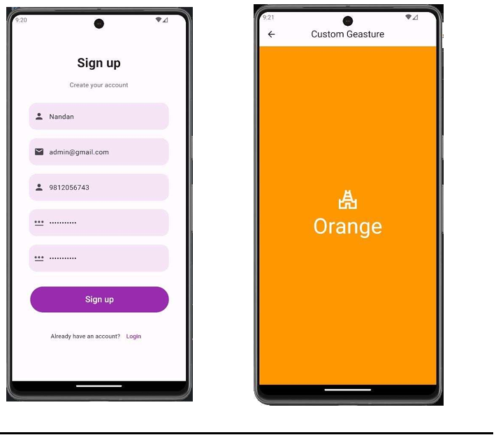
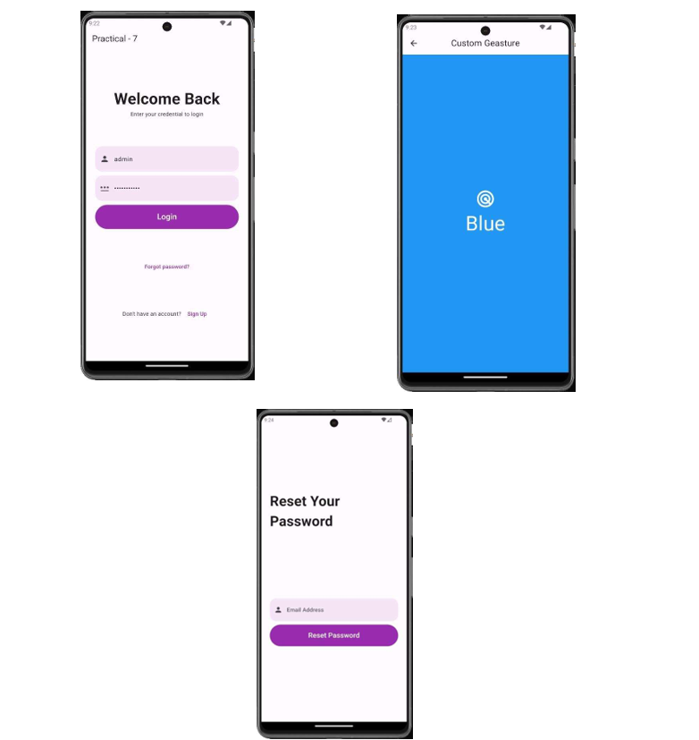

# 📱 App_Dev_journey 
  =>Code like it’s your superpower. Debug like it’s a side quest." 🦸‍♂️💻🔥

Welcome to my Application Development journey! 🚀  
This repo contains all the practical codes and mini-projects based on my college curriculum, built using **Flutter**.

---

## 🧠 Overview

> A collection of hands-on projects and practicals covering the fundamentals of mobile app development using Flutter. Perfect for beginners and academic reference.

---

## 🛠️ Built With

- 💙 Flutter
- 🎯 Dart
- 🔥 Firebase (for backend services)
- 🧩 Android Studio & VS Code

---

## 📸 Screenshots

## 📸 Screenshots

| Login & Dashboard     | Profile Page          |
|-----------------------|-----------------------|
|  |    |


---

## 📂 Folder Structure


---

## 🚀 Getting Started

1. **Clone the repo**  
   ```bash
   git clone https://github.com/yourusername/App_Dev_journey.git
2. **Navigate into a project folder**

    ```bash
    cd module_1/practical_1/
    
4. **Install Dependecies**
      
```bash
 flutter pub get

6. Run the app
    ``` bash
    flutter run


    


